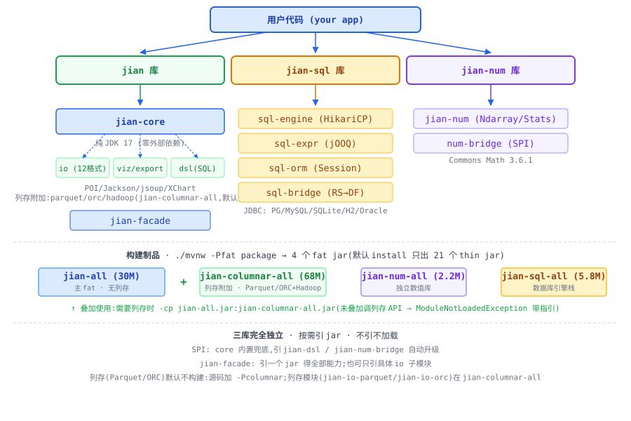

# JIAN · JVM 轻量数据栈

> **jian** = 拼音「简」= **J**ava **I**ntegrated **AN**alysis
>
> 以玉简之器,容数据之变;以简化之桥,渡语言之隙;以简约之道,立长久之基;以吉安之愿,佑用者之祥。

对标 **pandas / sqlalchemy / numpy** 子集的 JVM 数据栈。三个独立库,按需引用。

---

## 快速开始

```bash
# clone 后仅需 JDK 17+
./mvnw install
```

```java
import jian.Jian;
import jian.core.DataFrame;

// 读(按扩展名自动分发:csv/json/xlsx/html/xml/parquet/orc/pickle 等 12 格式)
DataFrame df = Jian.read("users.csv");

// 变换(链式,对齐 pandas)
DataFrame r = df.query("age > 18")
                .groupBy("dept")
                .agg(Map.of("salary", "mean"))
                .sortBy("salary_mean", false)
                .head(10);

// 内存 SQL(不碰数据库,支持多表 JOIN / 子查询)
Dsl.sql("SELECT city, avg(score) FROM ${t} GROUP BY city", df);
Dsl.sql("SELECT * FROM ${a} LEFT JOIN ${b} ON a.id=b.id", df1, df2);

// 写(按扩展名自动分发)
Jian.write(r, "report.html");
```

---

## 架构图



**三个独立库:**
- **jian** — DataFrame + 12 格式 IO + 17 图 + Styler 导出 + DSL(SQL 子集)
- **jian-sql** — Engine(HikariCP) + SqlBuilder(jOOQ) + ORM(Session) + Bridge
- **jian-num** — Ndarray + 描述统计 + 线代 + 随机数(对标 numpy 子集)

**核心设计:**
- 三库完全独立,jian-sql 不依赖 jian,jian-num 不依赖任何
- 按需引 jar,不引不加载(不引 jian-io-excel → JVM 不加载 POI)
- SPI 解耦:core 内置兜底,引了 jian-dsl / jian-num-bridge 自动升级
- 零本机绑定(无硬编码路径/凭据);精细引用(无 uber/shade)

---

## 模块清单(22 个子模块)

| 库 | 子模块 | 说明 |
|---|---|---|
| **jian** | jian-core | DataFrame/Series/GroupBy/Window/MultiIndex(9 dtype 列式) |
| | jian-io-csv | CSV/TSV/FWF |
| | jian-io-excel | xls/xlsx(逐列类型精确推断) |
| | jian-io-json | JSON 5 种 orient |
| | jian-io-html | HTML 表格(jsoup) |
| | jian-io-xml | XML(Jackson) |
| | jian-io-sql | 7 数据库通用(JDBC) |
| | jian-io-parquet | Parquet 列存 |
| | jian-io-orc | ORC 列存 |
| | jian-io-pickle | 自定义 .jpk 序列化 |
| | jian-io-clipboard | 跨平台剪贴板 |
| | jian-io-latex | LaTeX 表格 |
| | jian-viz | 13 种图表(PNG/SVG;4 种高维图 v2 规划) |
| | jian-export | HTML/Markdown/LaTeX/控制台 + Styler |
| | jian-dsl | L1 query + L2 eval + L3 SQL(Pratt+正则,零依赖) |
| | jian-num-bridge | StatsProvider SPI |
| | jian-facade | 顶层 Jian 门面(聚合全部 io) |
| **jian-sql** | jian-sql-engine | Engine + DbType(7库) + HikariCP |
| | jian-sql-expr | SqlBuilder(jOOQ 运行时模式) |
| | jian-sql-orm | Session ORM CRUD(@Table/@Column/@Id) |
| | jian-sql-bridge | ResultSet → DataFrame |
| **jian-num** | jian-num | Ndarray/Stats/Matrix/Random |

---

## 构建

```bash
./mvnw install          # 全量构建(阿里云镜像,Maven Wrapper 自带)
./mvnw -pl jian/jian-core -am compile    # 只构建 core
./mvnw test             # 跑全部 342 个测试
```

依赖管理:Maven 多模块 + 阿里云镜像(配置在 `.mvn/settings.xml`)。
精细引用,无 uber/fat jar,无 maven-shade(AGENTS.md §2.5)。

---

## 文档

- `doc/index.html` — 可视化门户(单文件,浏览器打开即用)
- `doc/00-overview.md` ~ `07-jian-dsl.md` — 详细需求与实现说明
- `NAMING.md` — 命名由来(玉简/简化/简约/吉安)
- `AGENTS.md` — 开发规范(凌驾全项目)

---

## 技术选型

| 积木 | 版本 | 用在 |
|---|---|---|
| Apache Commons CSV | 1.12.0 | jian-io-csv |
| Apache POI | 5.5.1 | jian-io-excel |
| Jackson | 2.18.2 | jian-io-json/xml |
| jsoup | 1.18.3 | jian-io-html |
| parquet-avro | 1.14.4 | jian-io-parquet |
| orc-core | 1.9.5 | jian-io-orc |
| XChart | 4.0.3 | jian-viz |
| Commons Math | 3.6.1 | jian-num |
| jOOQ | 3.21.6 | jian-sql-expr |
| HikariCP | 6.2.1 | jian-sql-engine |

---

## 免责声明（必读）

本项目由 AI 工具辅助开发，免费分发，不附带任何形式的担保。

**AI 生成内容**：本项目的需求文档、设计、代码均由 AI 工具辅助生成，可能存在错误、遗漏或未经验证的内容。使用者须自行核实、自行评估、自行测试。

**免费分发，"按现状"提供**：本项目以"按现状"（AS IS）基础免费提供，不收取任何费用，明示不提供任何明示或默示的担保，包括但不限于对适销性、特定用途适用性、非侵权、准确性、可靠性的担保。

**仅用于学习与交流目的**：本项目的核心目的是技术学习与研究交流——验证 JVM 上对标 pandas/numpy/sqlalchemy 的可行性，并非商业产品。不建议直接用于生产环境或关键业务。如需生产级方案，请评估商业支持的官方或第三方产品。

**不保证及时维护**：作者没有义务对本项目进行持续维护、版本跟进、问题修复或安全更新。使用者须做好"无人维护"的心理准备，自行 fork、自行修复。

**使用者自行承担全部安全风险**：本项目涉及数据库连接（凭据走 `.env` 环境变量）、文件读写、批量导入等多个安全敏感面。作者不担保本项目在任何使用场景下的安全性，相关风险包括但不限于：
- **凭据泄露**：示例中可能展示数据库连接方式；如使用者照搬配置、提交到版本库或部署到不可信环境，由此引发的后果由使用者自行承担；
- **数据隐私**：本项目读写各类数据文件（CSV/Excel/JSON/SQL/Parquet 等），作者不担保满足任何特定地区的合规要求（如 GDPR、个人信息保护法等）；
- **第三方依赖**：依赖 POI、Jackson、jOOQ、Commons Math 等第三方库，作者不担保这些依赖无漏洞、无供应链攻击风险；
- **数据精度**：Excel 等格式存在固有限制（如 double 存储导致 >15 位整数精度丢失），作者不担保数据转换的绝对准确性。

**不承担任何后果**：使用者因使用、复制、分发、修改或依赖本项目而产生的任何直接或间接损失——包括但不限于数据丢失、业务中断、凭据泄露、合规违规、第三方索赔——作者概不负责。

**数据无价，自行备份**：本项目涉及数据读写与格式转换，操作前请务必做好完整备份。

下载、安装、使用、复制、分发或以任何方式利用本项目，即视为已阅读、理解并无条件接受本免责声明的全部条款。如不同意，请立即停止使用并删除本项目。

---

## License

MIT
